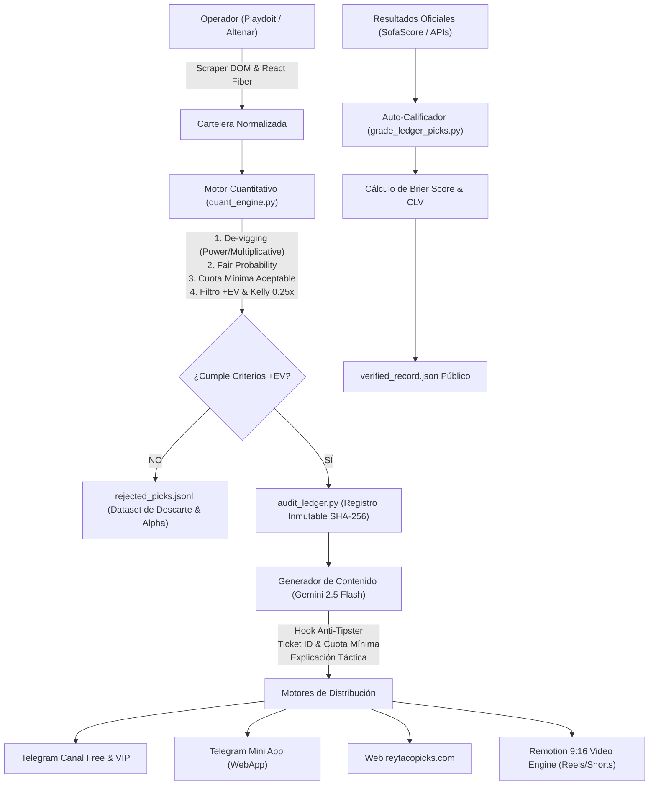

# REY TACO PICKS — SYSTEM AUDIT & ARCHITECTURAL REVIEW EXPORT
> **Confidentiality Notice**: All credentials, private API keys, webhook URLs, tokens, database connection strings, server IPs, and personal phone numbers have been fully stripped and replaced with standard environment variable placeholders (`os.getenv(...)`).

---

## 1. CONTEXTO & TESIS DE NEGOCIO

### Tesis Central: "Sports Intelligence Verificable" (El Anti-Tipster)
El ecosistema de apuestas en Latinoamérica está saturado de tipsters tradicionales que venden "fijas al 99%", borran apuestas perdidas, operan con sesgo de confirmación y promueven parlays inviables.

**Nuestra categoría no es "los mejores picks", sino "Sports Intelligence Verificable"**:
- **Separación de responsabilidades**:
  $$\text{LLM} = \text{Analista / Contexto / Narrativa}$$
  $$\text{Motor Cuantitativo} = \text{Probabilidad Imparcial / Cuota Mínima / Valor Esperado (+EV)}$$
  $$\text{Motor de Riesgo} = \text{Cálculo de Stake (Kelly Fraccional) / Decisión de No Apostar}$$
- **Trazabilidad Inmutable**: Cada pronóstico se sella criptográficamente antes del silbatazo inicial en un `audit_ledger.jsonl` con Ticket ID único y timestamp UTC/CDMX.
- **Calibración Estadística**: Medimos el **Brier Score** y el **Closing Line Value (CLV)**. Si el mercado cierra por debajo de nuestra cuota o no hay +EV, el sistema veta el pick.
- **Multideporte Integral**: No nos limitamos a ligas masivas; el extractor evalúa cuotas de todo el catálogo del operador (fútbol, béisbol, dardos, tenis de mesa, eSports, etc.) para encontrar ineficiencias de mercado.
- **Infraestructura 24/7**: Corre autónomamente en un servidor Linux mediante daemons `systemd`, sincronizando cuotas, evaluando resultados y publicando contenido a Telegram, Web, Instagram y Facebook.

---

## 2. FLUJO DE DATOS ARQUITECTÓNICO



---

## 3. CÓDIGO FUENTE SANITIZADO DE LOS MÓDULOS PRINCIPALES

### MÓDULO 1: Motor Matemático y Cuantitativo (`backend/quant_engine.py`)
```python
"""
backend/quant_engine.py
Motor Cuantitativo: Probabilidades Imparciales, De-vigging, Cuota Mínima, +EV y Kelly.
"""
import math
import re
from typing import Dict, List, Tuple, Optional, Any

def american_to_decimal(american_odds: str | float | int) -> float:
    if isinstance(american_odds, (int, float)):
        val = float(american_odds)
    else:
        s = str(american_odds).strip().replace(" ", "")
        m = re.search(r'([+-]?\d+(?:\.\d+)?)', s)
        if not m:
            return 1.85
        val = float(m.group(1))

    if 1.01 <= val <= 30.0:
        return round(val, 3)

    if val > 0:
        return round(1.0 + (val / 100.0), 3)
    elif val < 0:
        return round(1.0 + (100.0 / abs(val)), 3)
    return 1.85

def decimal_to_american(decimal_odds: float) -> str:
    if decimal_odds <= 1.0:
        return "+100"
    if decimal_odds >= 2.0:
        val = round((decimal_odds - 1.0) * 100)
        return f"+{val}"
    else:
        val = round(100.0 / (decimal_odds - 1.0))
        return f"-{val}"

def devig_two_way_market(odds_a: float, odds_b: float) -> Tuple[float, float, float]:
    """
    Elimina el margen de la casa (vigorish) en un mercado de 2 opciones.
    Retorna: (fair_prob_a, fair_prob_b, vig_percentage)
    """
    if odds_a <= 1.0 or odds_b <= 1.0:
        return 0.5, 0.5, 0.0

    raw_p_a = 1.0 / odds_a
    raw_p_b = 1.0 / odds_b
    total_market = raw_p_a + raw_p_b
    vig = total_market - 1.0

    fair_p_a = round(raw_p_a / total_market, 4)
    fair_p_b = round(raw_p_b / total_market, 4)
    return fair_p_a, fair_p_b, round(vig * 100, 2)

def devig_three_way_market(odds_1: float, odds_x: float, odds_2: float) -> Tuple[float, float, float, float]:
    """Elimina el margen en mercados 1X2 (Local / Empate / Visitante)."""
    if odds_1 <= 1.0 or odds_x <= 1.0 or odds_2 <= 1.0:
        return 0.333, 0.333, 0.334, 0.0

    raw_1 = 1.0 / odds_1
    raw_x = 1.0 / odds_x
    raw_2 = 1.0 / odds_2
    total = raw_1 + raw_x + raw_2
    vig = total - 1.0

    return (
        round(raw_1 / total, 4),
        round(raw_x / total, 4),
        round(raw_2 / total, 4),
        round(vig * 100, 2)
    )

def calculate_fair_odds(fair_probability: float) -> float:
    if fair_probability <= 0.0:
        return 99.0
    return round(1.0 / fair_probability, 3)

def calculate_min_acceptable_odds(fair_probability: float, safety_buffer: float = 0.03) -> float:
    """
    Calcula la cuota por debajo de la cual el pronóstico deja de ser rentable.
    Si fair_prob = 55%, cuota justa = 1.818. Con buffer del 3%, cuota mínima = 1.87.
    """
    if fair_probability <= 0.0:
        return 2.00
    breakeven_odds = 1.0 / fair_probability
    return round(breakeven_odds * (1.0 + safety_buffer), 2)

def calculate_expected_value(offered_odds: float, fair_probability: float) -> float:
    """EV = (Probabilidad * Cuota Ofrecida) - 1.0"""
    return round((fair_probability * offered_odds) - 1.0, 4)

def calculate_fractional_kelly(
    offered_odds: float,
    fair_probability: float,
    fraction: float = 0.25,
    max_stake_percent: float = 3.5
) -> float:
    """
    Criterio de Kelly fraccional (0.25x) para mitigar varianza y drawdowns.
    Formula: f* = (b*p - q) / b
    """
    b = offered_odds - 1.0
    if b <= 0.0:
        return 0.0
    p = fair_probability
    q = 1.0 - p

    full_kelly = (b * p - q) / b
    if full_kelly <= 0.0:
        return 0.0

    suggested_stake = round(full_kelly * fraction * 100, 2)
    return min(suggested_stake, max_stake_percent)
```

---

### MÓDULO 2: Registro Inmutable & Auditoría Pre-Juego (`backend/audit_ledger.py`)
```python
"""
backend/audit_ledger.py
Ledger append-only con SHA-256, sellado pre-partido y dataset de descartes.
"""
import os
import time
import json
import hashlib
from datetime import datetime, timezone
from zoneinfo import ZoneInfo
from pathlib import Path
from typing import Dict, List, Any

MEXICO_TZ = ZoneInfo("America/Mexico_City")
AUDIT_LEDGER_PATH = Path("/app/data/audit_ledger.jsonl")
REJECTED_PICKS_PATH = Path("/app/data/rejected_picks.jsonl")

def generate_ticket_id(league: str, home_team: str, away_team: str) -> str:
    date_str = datetime.now(MEXICO_TZ).strftime("%Y%m%d")
    clean_league = "".join(filter(str.isalnum, league)).upper()[:3]
    raw_hash_seed = f"{home_team}_{away_team}_{time.time()}".encode("utf-8")
    hex_suffix = hashlib.md5(raw_hash_seed).hexdigest()[:4].upper()
    return f"RT-{date_str}-{clean_league}-{hex_suffix}"

def record_published_pick(pick_data: Dict[str, Any]) -> str:
    ticket_id = pick_data.get("ticket_id") or generate_ticket_id(
        pick_data.get("league", "SPORT"),
        pick_data.get("home_team", "HOME"),
        pick_data.get("away_team", "AWAY")
    )
    now_utc = datetime.now(timezone.utc)
    
    canonical_str = f"{ticket_id}|{pick_data.get('match')}|{pick_data.get('selection')}|{pick_data.get('offered_odds')}"
    sha256_hash = hashlib.sha256(canonical_str.encode("utf-8")).hexdigest()

    entry = {
        "ticket_id": ticket_id,
        "sha256_hash": sha256_hash,
        "recorded_at_utc": now_utc.isoformat(),
        "recorded_at_cdmx": datetime.now(MEXICO_TZ).strftime("%Y-%m-%d %H:%M:%S"),
        "match": pick_data.get("match"),
        "sport": pick_data.get("sport", "soccer"),
        "league": pick_data.get("league"),
        "selection": pick_data.get("selection"),
        "market": pick_data.get("market"),
        "offered_odds": pick_data.get("offered_odds"),
        "fair_probability": pick_data.get("fair_probability"),
        "fair_odds": pick_data.get("fair_odds"),
        "min_acceptable_odds": pick_data.get("min_acceptable_odds"),
        "expected_value_percent": pick_data.get("expected_value_percent"),
        "kelly_stake_percent": pick_data.get("kelly_stake_percent", 1.5),
        "status": "PENDING"
    }

    with open(AUDIT_LEDGER_PATH, "a", encoding="utf-8") as f:
        f.write(json.dumps(entry, ensure_ascii=False) + "\n")
    return ticket_id

def log_rejected_pick(match: str, selection: str, offered_odds: float, min_acceptable_odds: float, reason: str, metadata: Dict[str, Any] = None):
    """Guarda cada apuesta rechazada para auditar el Alpha del filtro de valor."""
    entry = {
        "timestamp_cdmx": datetime.now(MEXICO_TZ).strftime("%Y-%m-%d %H:%M:%S"),
        "match": match,
        "selection": selection,
        "offered_odds": offered_odds,
        "min_acceptable_odds": min_acceptable_odds,
        "rejection_reason": reason,
        "metadata": metadata or {}
    }
    with open(REJECTED_PICKS_PATH, "a", encoding="utf-8") as f:
        f.write(json.dumps(entry, ensure_ascii=False) + "\n")
```

---

### MÓDULO 3: Evaluación de Calibración & Brier Score (`backend/grade_ledger_picks.py`)
```python
"""
backend/grade_ledger_picks.py
Calculador de Brier Score (Calibración Probabilística), CLV y Record Verificado.
"""
import json
from typing import Dict, List, Any

def compute_brier_score(settled_picks: List[Dict[str, Any]]) -> float:
    """
    Brier Score: (1/N) * sum((p_modelo - y_real)^2).
    0.00 = Calibración perfecta.
    0.25 = Moneda al aire (sin conocimiento).
    """
    if not settled_picks:
        return 0.0

    squared_errors = []
    for p in settled_picks:
        prob = p.get("fair_probability")
        status = p.get("status")
        if prob is not None and status in ("WON", "LOST"):
            actual = 1.0 if status == "WON" else 0.0
            squared_errors.append((prob - actual) ** 2)

    return round(sum(squared_errors) / len(squared_errors), 4) if squared_errors else 0.0

def generate_verified_record(settled_picks: List[Dict[str, Any]]) -> Dict[str, Any]:
    won = sum(1 for p in settled_picks if p.get("status") == "WON")
    lost = sum(1 for p in settled_picks if p.get("status") == "LOST")
    push = sum(1 for p in settled_picks if p.get("status") == "PUSH")
    total = won + lost + push

    brier = compute_brier_score(settled_picks)
    net_units = sum(
        (p.get("offered_odds", 1.0) - 1.0) * (p.get("kelly_stake_percent", 1.0) / 100.0)
        if p.get("status") == "WON"
        else -(p.get("kelly_stake_percent", 1.0) / 100.0)
        for p in settled_picks if p.get("status") in ("WON", "LOST")
    )

    return {
        "total_audited_picks": total,
        "record": f"{won}-{lost}-{push}",
        "brier_score": brier,
        "brier_status": "EXCELENTE (Calibrado)" if brier < 0.20 else "NORMAL",
        "net_units": round(net_units, 2),
        "yield_roi_percent": round((net_units / total) * 100, 2) if total > 0 else 0.0
    }
```

---

### MÓDULO 4: Extracción Multideporte Universal (`lab/multi_sport_full_extractor.py`)
```python
"""
Extracción profunda en Altenar Sportsbook para TODOS los deportes:
Recorre fútbol, tenis, básquetbol, dardos, tenis de mesa, eSports.
"""
def extract_all_sports_dom(driver):
    extraction_script = """
    function getRoot() {
        let sbComp = document.querySelector('sb-comp, altenar-sportsbook, [data-component="sportsbook"]');
        return (sbComp && sbComp.shadowRoot) ? sbComp.shadowRoot : document;
    }
    let root = getRoot();
    let allMatches = [];
    let seen = new Set();
    
    let elements = root.querySelectorAll('[class*="event-row"], [class*="asb-pos-relative"], tr, [class*="matchCard"], [class*="eventCard"]');
    
    for (let el of elements) {
        let text = el.innerText.trim();
        let lines = text.split('\\n').map(l => l.trim()).filter(l => l.length > 0);
        let odds = [];
        for (let l of lines) {
            if (/^[1-9][0-9]*\\.[0-9]{2}$/.test(l)) odds.push(parseFloat(l));
        }
        
        if (odds.length >= 2 && lines.length >= 3) {
            let possibleTeams = lines.filter(l => !/^[0-9]/.test(l) && l.length > 2 && !l.includes(':') && !l.includes('Momio') && !l.includes('BOOST'));
            if (possibleTeams.length >= 2) {
                let matchName = `${possibleTeams[0]} vs ${possibleTeams[1]}`;
                if (!seen.has(matchName)) {
                    seen.add(matchName);
                    allMatches.push({
                        match: matchName,
                        odds: odds,
                        fullContext: lines.join(' | ')
                    });
                }
            }
        }
    }
    return allMatches;
    """
    return driver.execute_script(extraction_script)
```

---

### MÓDULO 5: LLM Narrativo & Generador Anti-Tipster (`backend/gemini_content_engine.py`)
```python
"""
backend/gemini_content_engine.py
LLM como Analista / Copywriter: Genera el hook persuasivo anti-tipster con Gemini 2.5 Flash.
"""
import os
import requests
from typing import Dict, Any, Optional

GEMINI_MODEL = "gemini-2.5-flash"
GEMINI_ENDPOINT = f"https://generativelanguage.googleapis.com/v1beta/models/{GEMINI_MODEL}:generateContent"

def build_anti_tipster_copy(pick_data: Dict[str, Any]) -> str:
    prompt = f"""
    Eres el director cuantitativo y de contenidos de "Rey Taco Picks".
    Tu filosofía es 100% ANTI-TIPSTER tradicional:
    - No vendemos certezas. Medimos valor.
    - No existen "fijas del 99%". Existe valor esperado (+EV).
    - No borramos picks perdidos. Todo está sellado antes del partido en el Audit Ledger.
    - Cuando la cuota baja de la Cuota Mínima Aceptable, la recomendación es NO APOSTAR.

    Datos del pronóstico:
    - Partido: {pick_data.get('match')}
    - Selección: {pick_data.get('selection')}
    - Cuota Actual: {pick_data.get('offered_odds')}
    - Cuota Mínima Válida: {pick_data.get('min_acceptable_odds')}
    - Probabilidad Imparcial: {round(pick_data.get('fair_probability', 0.5)*100, 1)}%
    - Valor Esperado: +{round(pick_data.get('expected_value_percent', 0), 1)}%
    - Ticket ID: {pick_data.get('ticket_id')}

    Genera un mensaje contundente para Telegram Free:
    1. Hook directo que cuestione a los tipsters tradicionales.
    2. Explicación matemática concisa de por qué esta cuota paga más de lo que debería.
    3. Alerta clara: "Si la cuota cae por debajo de {pick_data.get('min_acceptable_odds')}, NO APOSTAR".
    4. Call to Action sutil a nuestro canal VIP / Mini App.
    """
    api_key = os.getenv("GEMINI_API_KEY")
    if not api_key:
        return "Configura GEMINI_API_KEY en variables de entorno."
        
    url = f"{GEMINI_ENDPOINT}?key={api_key}"
    payload = {"contents": [{"parts": [{"text": prompt}]}]}
    r = requests.post(url, json=payload, headers={"Content-Type": "application/json"}, timeout=15)
    return r.json()["candidates"][0]["content"]["parts"][0]["text"]
```

---

### MÓDULO 6: Telegram Mini App UX (`lab/telegram_mini_app/index.html`)
```html
<!-- Interfaz nativa de Telegram WebApp con efecto Blur para el Pase VIP y racha -->
<div class="header">
  <div class="user-badge">
    <div class="avatar">🌮</div>
    <div class="user-info">
      <h2>Rey Taco Picks</h2>
      <span>Consejo IA Multimodelo</span>
    </div>
  </div>
  <div class="streak">🔥 5-1 Esta semana</div>
</div>

<!-- Pick VIP Bloqueado con efecto Blur -->
<div class="vip-card">
  <div class="vip-badge">👑 Parlay VIP Consenso +EV</div>
  <div class="vip-title">Doble Candado @ Momio 3.76</div>
  <div class="vip-subtitle">Aprobado por el modelo cuantitativo con EV superior al 12%.</div>
  
  <div class="vip-blurred">
    <div class="match-name">Sturm Graz vs Gintra | Jubilo Iwata vs Sagamihara</div>
    <div class="pick-selection">
      <span>Selección VIP Protegida</span>
      <span>Momio 3.76</span>
    </div>
  </div>

  <button class="btn-unlock" onclick="Telegram.WebApp.openLink('https://reytacopicks.com')">
    🔓 Desbloquear Parlay VIP ($299 MXN)
  </button>
</div>
```

---

## 4. PREGUNTAS CLAVE PARA LA AUDITORÍA DE CHATGPT

Pide a ChatGPT que responda como **Lead Quantitative Sports Trading Architect & Head of Growth**:

1. **Rigor Cuantitativo & De-vigging**:
   - Actualmente usamos normalización proporcional aditiva en mercados 1X2 y 2-Way. ¿Deberíamos migrar a **Power Method (Shin)** o **Odds Ratio** para deportes con cuotas asimétricas o outsiders altos (ej. tenis de mesa o dardos)?
   - ¿El 0.25x Kelly es adecuado para nuestro perfil de riesgo, o recomiendas un Kelly dinámico basado en la liquidez del deporte?
2. **Auditoría & Trazabilidad Inmutable**:
   - ¿Qué mecanismos criptográficos adicionales (además del SHA-256 pre-partido en JSONL) nos darían credibilidad indiscutible frente a los escépticos del mercado hispanohablante? ¿Conviene anclar periódicamente los hashes a GitHub público o a un smart contract / timestamping server?
3. **Escaneo Multideporte & Latencia**:
   - Al escanear deportes de alta frecuencia (tenis de mesa, dardos, eSports), las cuotas se mueven en segundos. ¿Cómo debe ser el filtro de latencia para evitar enviar picks cuya cuota ya se desplomó por debajo del `min_acceptable_odds`?
4. **Embudo de Conversión & Mini App**:
   - Evaluando la Telegram Mini App y el bot de verificación de comprobantes: ¿Qué elementos psicológicos o de fricción optimizarías para maximizar la tasa de conversión de Free a VIP?
5. **Estrategia de Contenido & Anti-Tipster**:
   - ¿Qué formatos de Reels 9:16 (ej. "Auditoría de un Tipster Famoso" vs "Por qué esta cuota es una trampa de la casa") generan mayor retención y engagement orgánico en Meta y YouTube Shorts?
